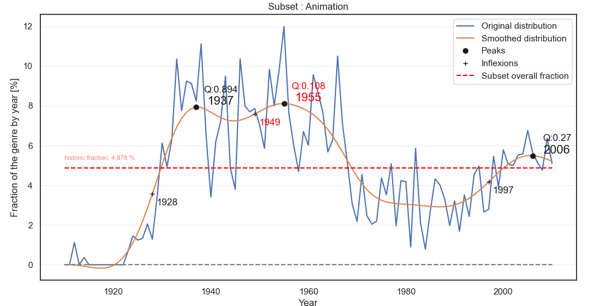

<iframe src="plots/interactive_movie_data5.html" width="700" height="500" frameborder="0"></iframe>


## Definition
We defines movies that serve as wellsprings of inspiration and set the trends. This are movies that are so innovative that they changed the cinematic worlds forever. These are movies that are not only successful but also films that get heavily imitated, even parodied, and, most importantly, act as a construction basis for future movies.

We focus on american movies. If you want more information about data cleaning and data augmentations follow this: [Link to Data](data.md)


## Methods ⚙️

### Step 1 we need to find the highest trends:

We define a trend as a significant positive variation in the number of movies released in a particular genre compared to other genres. This trend is characterized by a notably higher increase in the volume of movies within a specific genre, indicating a rising popularity or interest relative to others.
Trends should be caracterize by a high bump.
In order find the best trends we first smooth the number of movies released each year. Smoothing data from different years allows for a more direct comparison by minimizing the impact of short-term fluctuations.
We first applies a low-pass Butterworth filter to the input signal for smoothing. It then identifies the local maxima (peaks) and inflection points in the smoothed signal. A peak is considered significant if it is higher than a given fraction ('frac') of the maximum value in the signal. Additionally, the 'quality' of a peak is assessed based on its prominence over the nearest inflection point, relative to 'frac'. Only peaks meeting both criteria (height and quality) are returned.



### Step 2 get the candidates that could be pivotals:
Once the bumps has been identified, we will select a range prior to the trend peak, assuming the pivotal movie lies inside of it. It is important to choose a proper range so we don't miss the pivotal movie (too short range), and we don't predict a movie without relation (too big range). Recognizing that films influencing a trend wouldn't be released immediately, we acknowledge the time it takes to produce a movie from scratch, typically spanning 2-3 years in 2006 ([1](https://nofilmschool.com/how-long-does-it-take-to-make-a-movie)),([2](https://www.studiobinder.com/blog/how-long-does-it-take-to-make-a-movie/)). Then, the first approach is to select a range of 5 prior years, which seems reasonable. Otherwise, a more precise method that requires more work and hypothesis would be to identify a bump as a roughly (skewed) gaussian curve. Then we could select a range of 1-2 standard deviations prior to the mean/median/mode.


### Step 5: Pivotal Score
Finally, we will select the most probable pivotal movie of the selected range, which maximizes a score. From our definition of pivotal movie, the score would be based on money generated (which reflects how many people watched the movie) and public advise (how was the movie recieved). The metrics used here would be box-office and review score. Then if several movies reached the top score within a certain threshold, our intuition is to prefer the earliest movie released, because it would be the most likely to influence later releases.

We might investigate further metrics, such as differentiating public and press review score. We’re also thinking of the impact of inflation on the revenue (Fig. 2). It would be interesting to adapt the box-office to the real value of money according to its release year. Then observe if this changes the pivotal movie selected.

##  Metric assessment for Pivotal Movies identification

Identifying the pivotal movie, or the one that starts a trend, involves a combination of qualitative and quantitative analysis. Here are considerations and steps to help define the chosen pivotal movie within a specific genre:

 - **Box-office Revenue :**
    Analyze the box-office performance of candidate movies within the subset. The pivotal movie often exhibits exceptional financial success, indicating a strong audience demand for the particular genre or theme. We need then to look for movies that surpassed industry expectations in terms of revenue. Also comparing the box-office performance of candidate movies to industry standards and consider their impact on subsequent films' budgeting and revenue expectations.

- **Reviews :**
   Critical reception is a key indicator of a movie's impact and lasting influence. The pivotal movie should have received positive reviews from both critics and audiences, showcasing its quality and appeal. To this aims we incorporate a new dataset that includes review. These review will be a measuremnent of how good a movie is . This metric is fundamental to identify the pivotal movie : if a film is considered as bad there is no chance that it influence the cinema industry and creating a trend.

- **Awards :**
Another measure for assessing influence is the recognition garnered through awards. Industry accolades serve as a validation of a movie's cultural and artistic significance. The receipt of awards signifies not only the excellence of the film but also its potential to set a standard worth emulating. It provides more precise insights into why the film is esteemed. Noteworthy awards include prestigious honors like the Oscars. In our analysis, we have opted to incorporate a dataset that encompasses these awards and their respective categories.

- **Plot Similarity:**
  This metric serves as an assessment of the extent to which a film influences others within the genre during trends. The concept is as follows: if the plot of a potential pivotal film closely resembles those observed in subsequent trend films when compared to other movies in the candidate subset, it indicates the film's influence on plot development. This similarity suggests that other films intentionally emulated the storyline, signifying the impactful nature of the pivotal film.


All these metrics will be exploited to select the pivotal film among the candidate subset. But to use it we need to properly define function which calculate from available data or simply add missing data from other dataset.


### ML approach
We’d like to introduce a ML approach to automate the research of pivotal movies. By selecting features that capture the “trend”, with a training set of movies identified as pivotal and not (from the previous approach). Then we’ll fine tune weights to have a robust model, and possibly reveal more pivotal movies. To reduce computations, we could analyze the dataset only by a 10-year tranche. To fine tune the weights we prepase a small set of 50% pivotal movies and 50% unpivotals movies and we train a logistic regression on it in order to get the appropriate weights. The pivotal movies will be the movie that gets the best score acording to the weights. 


### Step 1: Pre-processing
Pre-processing consist in formatting the data in a way that facilitate further analysis and computations. We will handle missing data and outliers, and normalize the data. We will also enrich the data with additionnal datasets, by merging informations.

We will also filter the dataset, to be more precise on the data covered. We decided to focus on the movies in English and produced by the US. We could introduce more filtering later if needed…

### Step 2: Subsets
There are several ways to create a subset. It has to be relevant enough to analyze a trend. The easier approach is to use genres of movies, but other methods could be interesting to investigate. For example, we could extract vocabulary from a summary (ex: spaceships). Also, our dataset provides us very interesting substance : processed NLP which extracts tropes from summaries (type of character in a movie). Thus, we could analyze occurrences of tropes over time, and possibly draw trends.

We will start by creating simple subsets of genres. Then we will explore other ideas as extra.

We have to be careful when creating subsets to get meaningful results, because a too large one would group movies with not much in common together, and a too small one would group too few movies to draw interesting conclusions.

### Step 3: Shape analysis
We noticed that the number of movies over time has exploded in early 2000's (Fig. 1), then a rough analysis of the distribution wouldn’t be robust. To get more interesting results, we’d like to compare and visualize the evolution of fraction of movies from a specific subset. By plotting this curve, we are seeking an unusual shape, such as a bump or high variation. We typically recognize an unusual shape (of a subset) if it differs from the baseline (whole dataset).

A nice visualization would be a stacked plot to combine both number of releases and fractions of subsets. Here, a problem we might encounter is the high number of genres, because that would require too many colors and overload the graph. An idea to solve this issue is to group genres into 5-10 main categories, and have a more readable plot. For example the genre “airplanes and airport” isn’t that representative yet for a first visualization, however it could be that this category reveals a peak of trend with further analysis…

### Step 4: Range selection of prior movies
Once the unusual shape(s) has been identified, we will select a range prior to the trend peak, assuming the pivotal movie lies inside of it. It is important to choose a proper range so we don't miss the pivotal movie (too short range), and we don't predict a movie without relation (too big range). Recognizing that films influencing a trend wouldn't be released immediately, we acknowledge the time it takes to produce a movie from scratch, typically spanning 2-3 years in 2006 ([1](https://nofilmschool.com/how-long-does-it-take-to-make-a-movie)),([2](https://www.studiobinder.com/blog/how-long-does-it-take-to-make-a-movie/)). Then, the first approach is to select a range of 5 prior years, which seems reasonable. Otherwise, a more precise method that requires more work and hypothesis would be to identify a bump as a roughly (skewed) gaussian curve. Then we could select a range of 1-2 standard deviations prior to the mean/median/mode.

### Step 5: Pivotal Score
Finally, we will select the most probable pivotal movie of the selected range, which maximizes a score. From our definition of pivotal movie, the score would be based on money generated (which reflects how many people watched the movie) and public advise (how was the movie recieved). The metrics used here would be box-office and review score. Then if several movies reached the top score within a certain threshold, our intuition is to prefer the earliest movie released, because it would be the most likely to influence later releases.

We might investigate further metrics, such as differentiating public and press review score. We’re also thinking of the impact of inflation on the revenue (Fig. 2). It would be interesting to adapt the box-office to the real value of money according to its release year. Then observe if this changes the pivotal movie selected.

### Further steps: ML approach
We’d like to introduce a ML approach to automate the research of pivotal movies. By selecting features that capture the “trend”, with a training set of movies identified as pivotal and not (from the previous approach). Then we’ll fine tune weights to have a robust model, and possibly reveal more pivotal movies. To reduce computations, we could analyze the dataset only by a 10-year tranche.


Text can be **bold**, _italic_, or ~~strikethrough~~.

[Link to another page](./another-page.html).

There should be whitespace between paragraphs.

There should be whitespace between paragraphs. We recommend including a README, or a file with information about your project.

# Header 1

This is a normal paragraph following a header. GitHub is a code hosting platform for version control and collaboration. It lets you and others work together on projects from anywhere.

## Header 2

> This is a blockquote following a header.
>
> When something is important enough, you do it even if the odds are not in your favor.

### Header 3

```js
// Javascript code with syntax highlighting.
var fun = function lang(l) {
  dateformat.i18n = require('./lang/' + l)
  return true;
}
```

```ruby
# Ruby code with syntax highlighting
GitHubPages::Dependencies.gems.each do |gem, version|
  s.add_dependency(gem, "= #{version}")
end
```

#### Header 4

*   This is an unordered list following a header.
*   This is an unordered list following a header.
*   This is an unordered list following a header.

##### Header 5

1.  This is an ordered list following a header.
2.  This is an ordered list following a header.
3.  This is an ordered list following a header.

###### Header 6

| head1        | head two          | three |
|:-------------|:------------------|:------|
| ok           | good swedish fish | nice  |
| out of stock | good and plenty   | nice  |
| ok           | good `oreos`      | hmm   |
| ok           | good `zoute` drop | yumm  |

### There's a horizontal rule below this.

* * *

### Here is an unordered list:

*   Item foo
*   Item bar
*   Item baz
*   Item zip

### And an ordered list:

1.  Item one
1.  Item two
1.  Item three
1.  Item four

### And a nested list:

- level 1 item
  - level 2 item
  - level 2 item
    - level 3 item
    - level 3 item
- level 1 item
  - level 2 item
  - level 2 item
  - level 2 item
- level 1 item
  - level 2 item
  - level 2 item
- level 1 item

### Small image


### Large image


### Definition lists can be used with HTML syntax.

<dl>
<dt>Name</dt>
<dd>Godzilla</dd>
<dt>Born</dt>
<dd>1952</dd>
<dt>Birthplace</dt>
<dd>Japan</dd>
<dt>Color</dt>
<dd>Green</dd>
</dl>

```
Long, single-line code blocks should not wrap. They should horizontally scroll if they are too long. This line should be long enough to demonstrate this.
```

```
The final element.
```
--- layout: default ---
--- 
layout: default
---


# ADA Template Website
## Usage
1. Fork (copy) this repository by clicking the "Fork" button on the top right corner.
2. Go to "Settings" -> "Pages" in your forked repository. Under "Branch" change "None" to "master" and click "Save".
3. Edit the `_config.yml` file in your forked repository to change the site title (after `title:`) and description (after `description:`).
4. Build your own page by editing this `README.md` (home page) and creating new `.md` files (other pages), formatting is done with standard [GitHub Markdown syntax](https://docs.github.com/en/get-started/writing-on-github/getting-started-with-writing-and-formatting-on-github/basic-writing-and-formatting-syntax), we provide an example file `example.md` in the repository.
**Important**: Please include ```--- layout: default ---``` (the first three line in `example.md`) at the beginning of your every newly created `.md` file.
5. Add your new `.md` files to the site by editing the `_config.yml` file in your forked repository. Under `navigation:` add a new pair of `- title:` and `url:`, and fill their value with your page name and `.md` file name. Remember to remove the `- title:` and `url:` pair for the example page.
6. Go back to "Settings" -> "Pages" to find your website link.
