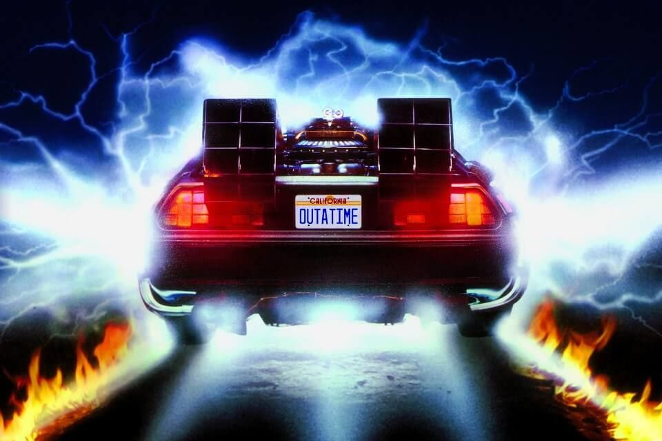
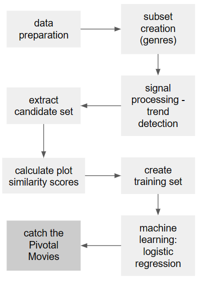

# Pivotal Movies: Catch them if you can!

### By TheWestBobers, a.k.a: Mehdi Abarro, Arthur Chansel, David Lacour, Paul Rebour, Manuel Zemp

## A Pivotal Movie - what’s that?

The history of cinema is shaped by innovation and cycles. A genre is created, while another dives into the abyss of indifference. Life and death, Yin and Yang. And every now and then magic happens: a golden age. Everyone has an uncle that keeps raving about the good ol’ Clint Eastwood Western days (or is that just us?). These golden ages are prime examples of snowball effects, introduced by single movies that stand out of the crowd and shape the future of the movie industry by creating a new trend.

At least this is the assumption on which we base this data project. There are singular movies, that can be identified as being the source of a trend, that produced a concentrated release of movies similar to that singular one. TheWestBobers call these Pivotal Movies. 

## The objective

In the course of this data story, we will show you our way to identify these Pivotal Movies. Based on several [datasets](the_data.md), which provide us with a series of metrics on a broad range of movies, a [identification-method](our_method.md) has been developed. With this, we are able to discover [the Pivotal Movies](the_results.md) throughout the history of cinema. 

But be warned: Take our results with a good amount of salt - they result from an experimental analysis and therefore are subject to major limitations. 

Here you can see an organigram of our method, which is explained in more detail [here](our_method.md). 

## Now let’s go on this data exploration journey together…

