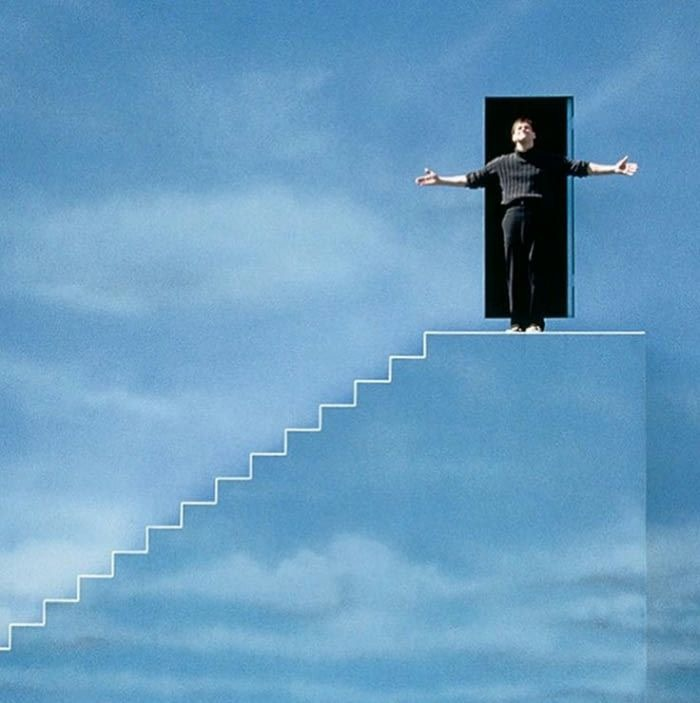

# Conclusion

We have successfully designed a method, which allows us to identify influential movies. The fact that some of these are present in lists such as the IMDb “100 best movies of all time” confirms, that our analysis has the power to be successful. Ideally, some more code tweaking and the addition of more metrics could lead to a very powerful tool, which can deliver interesting insights into the history of the cinematic universe. 

Whether these movies are the Pivotal Movies, that really were the triggering element of the historical trends in the movie industry cannot be determined for sure. The term Pivotal Movie cannot be broken down onto a clearly defined number of traits, as it is a conceptual idea. TheWestBobers approach was to assume that the most “successful” movie (based on different metrics that are a mix of industry, financial, and public aspects) in a trend (defined by a time window and a genre / double-genre constraint) is the most likely to be pivotal.

## Limitations

A purely data based analysis and a very limited number of metrics are leading to major limitations of the outcome:

Our analysis focuses on the inflection points of the smoothed genre fraction signal. The problem with this method is, that if we had chosen another signal processing algorithm, we could have had slightly different dates for the inflections, which could possibly lead to totally different results. Also the choice for the timeframe of the candidate set is a very critical one for the performance of our algorithm. Even though we based these assumptions on sound logical reasoning, there are still some insecurities present, leading to limitation of the results. 

Some genres are very vague, and there are many films classified in these (e.g. Comedy, Fantasy), so the pivotal points we find may not be representative of the genre. To counteract this, we would need to make a more precise analysis that goes beyond the genre, but takes into account the themes addressed in the film (e.g. Comedy-"high school", Science Fiction-"spaceship"). 

We also assume that a trend is always caused by a film, but some trends are in fact caused by external elements, like historical events. The assumption that a singular movie is responsible for a whole trend within the genre is a fundamental part of our analysis, and can for sure be questioned. 

We assume that the shape of a trend always stands out, with a noticeable inflection point, but we've noticed that some trends don't always have this shape. There are peaks, that have been classified by our algorithm to be of sufficient quality, even though a closer look tells differently: They are very flat, and therefore we cannot say that there has been a strong trend. An example of this is the Crime Fiction peak of 1948. 

### In conclusion: 

If you don’t know the movies that our algorithm identified as Pivotal Movies - then hop onto the cinema chairs with our data analysis friends and enjoy them together! 

This ends this data story: in case we don't see ya, good afternoon, good evening and good night!

