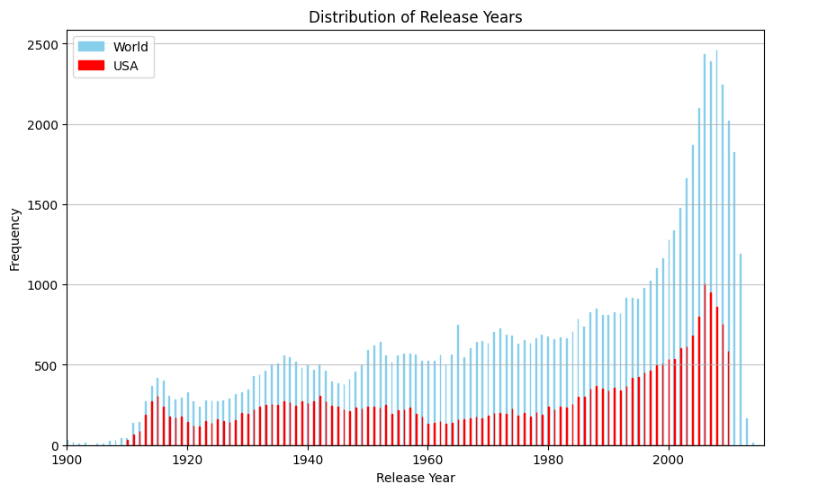
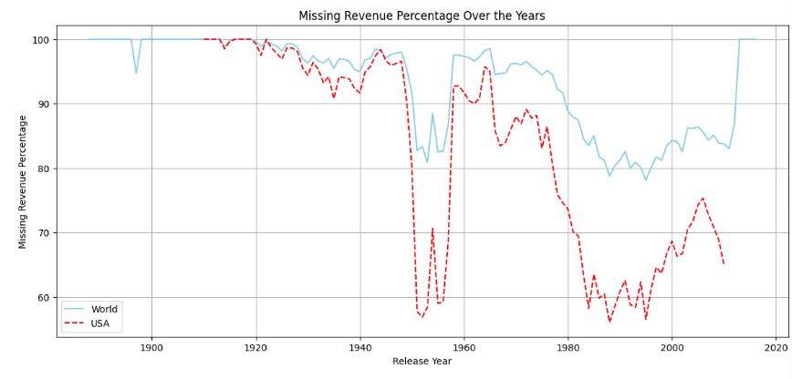
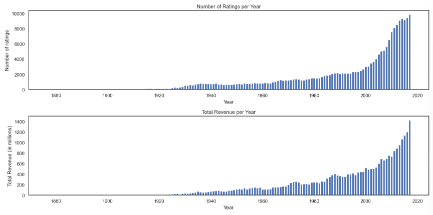
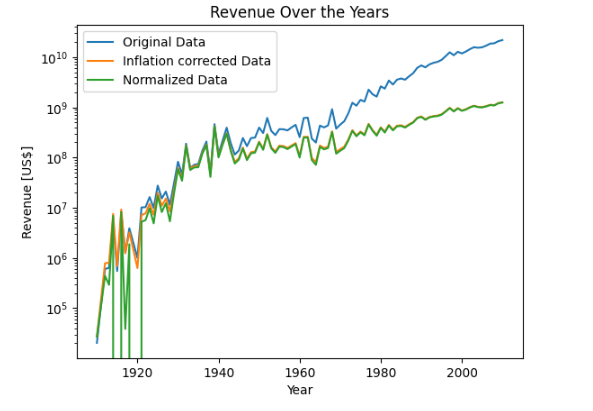

-   **Data Exploration** : Interact with the dataset to gain insights and explore potential avenues for analyzing movies and identifying trends.

-   **Data Cleaning** : Clean the dataset to retain only movies that possess the relevant features necessary for our analysis. This step ensures that we work with a refined and focused dataset.

-   **Dataset Augmentation** : Enhance the dataset by incorporating additional features, as outlined in the ReadMe. Notably, we will include movie ratings, which are important for characterizing the popularity of movies.

-   **id_wiki:** This is a unique identifier associated with each movie on Wikipedia.

-   **id_freebase:** This is a unique identifier associated with each movie on Freebase. This feature provides no useful information, as databases from Freebase were merged with Wikipedia in 2014.

-   **name:** Title of the movie.

-   **date:** Date of release of the movie.

-   **box_office:** Contains the box office revenue in dollars.

-   **runtime:** Duration of the film in minutes.

-   **lang:** This column indicates the languages used in the original (VO) movie.

-   **countries:** This column is associated with the country of production of the movie.

-   **genres:** Genres associated with the film.

Let's look at the distribution among the years; this is important because if we want to find the movie that creates trends, we need to take into account the distribution. We have to be careful because each year more and more movies are released, mainly because of technological advances.

# Cleaning the data

This part focuses on cleaning the data. Indeed, cleaning data is an important step for accurate data analysis. It ensures the integrity of results, reduces the risk of errors, and promotes consistency in reporting. Clean data enhances data understanding, uncovering valuable insights and patterns. Moreover, it facilitates compatibility with other datasets, mitigates bias, and ensures compliance with industry regulations. In essence, data cleaning is an essential step that contributes to the overall quality and effectiveness of data-driven processes. But first things first, let's make a deep copy of the dataset before filtering.

In order to identify pivotal movies, some features of data are crucial. First is data linked to trend identification. To identify trends for movies, we need two features: the **date of release** and the **genres** of the movie. Then, we remove all movies that have either a missing date feature or a missing genres feature.

Looks like we have some duplicates. We'll merge them so that we keep all the relevant information. For example, let's look at the Indiana Jones movie.

### Changing the features format

Now that the missing data has been dropped, we will address unclear features in the dataset. Building on the example of 'Twilight' from part 1, we observed that the presentation of languages, countries, and genres needed improvement. Let's reorganize and standardize these features for better clarity. Additionally, we'll modify the date format to establish a consistent basis for every film in the dataset.

These columns ('lang', 'countries', 'genres') are initially strings representing dictionaries, they converted in list containing only their values.

In the 'countries' column, any occurrence of the string 'United States of America' is replaced with 'USA'.

### Description

The `data_format` function is designed to format specific columns in a DataFrame (`df`). It primarily focuses on converting string representations of dictionaries into lists, replacing certain country names, and transforming date formats.

The 'date' column is expected to be in a string format with dates potentially containing day and month (yyyy-mm-dd or yyyy-mm).

We removes the month and day parts (if present), leaving only the year.

### Boundary definition

To ensure the accuracy of our data for analysis, it is crucial to define boundaries within the 'date' feature. Occasionally, incorrect data may be present, leading to inconsistencies. Let's identify and rectify such errors to maintain data integrity and ensure meaningful analysis.

We first removes the movies present before 1800.

### Filtering data

The last step is to filter our data. Indeed, we want to focus our analysis only on movies produced in the USA and in the English language.

# Enrich Data

### is there missing revenue?

As seen in the previous part a lot data is missing for the revenue column. Furthermore, for future analysis of pivotal movies (cf README), we would like to have a review feature. This feature will take value from 0 to 10 and will be linked to another feature : number of reviews available. So we will add the two dataset below.

## Additional datasets 📈

[Movielens](https://grouplens.org/datasets/movielens/) contains 45'466 movie including budget, box office and reviews, it will allow us to compute more precise metrics.

[MovieStats](https://github.com/danielgrijalva/movie-stats) contains 7'668 movies including budget, box office and reviews, by scrapping IMDb between 1980 and 2010 to complete missing values from our dataset and compute more precise metrics.

We repeat the cleaning process and add the two extra dataframes.

## Further cleaning and data gathering

Adding IMDB dataset:

This dataset contains data for 2.5 million movies/series listed on the official website of IMDB.

## Features

-   `id` - Movie ID
-   `name` - Name of the Movie
-   `year` - Year of movie release
-   `rating` - Rating of the Movie
-   `certificate` - Movie Certification
-   `duration` - Duration of the Movie
-   `genre` - Genre of the Movie
-   `votes` - Number of people who voted for the IMDB rating
-   `gross_income` - Gross Income of the Movie
-   `directors_id` - ID of Directors who have worked on the movie

1.  **Get Rid of Missing Movie Names:** Remove entries from the dataframe where movie names are missing.
2.  **Removing Some Characters and Extracting Starting Year Only:** Clean specific fields by removing unwanted characters and extract only the starting year.
3.  **Dataframe Reduction (Pre-2018 Movies):** Filter the dataframe to include only movies released before 2018, as we don't need information about movies post-2017.
4.  **Gross Income Cleaning and Conversion:** From the gross income field, remove undesired characters and convert the values to float type.
5.  **Votes Cleaning and Conversion:** Similar to gross income, remove undesired characters from the votes field and convert the values to float type.
6.  **Extract Number from Duration:** Isolate and extract the numerical value from the duration field.
7.  **Dataframe Deduplication Using Spark:** To handle the large size of the dataframe efficiently, use Apache Spark for fusing duplicate entries.

### Original name map

#### Context

Each dataset is contained in a gzipped, tab-separated-values (TSV) formatted file in the UTF-8 character set. The first line in each file contains headers that describe what is in each column. A ‘\N’ is used to denote that a particular field is missing or null for that title/name. The available datasets are as follows:

We use the imdb title map to deal with nomenclature changes for same movie across dataframes. We repeat the same change as above and we merge.

### Award dataset

#### Context

The Academy Awards, also officially and popularly known as the Oscars, are awards for artistic and technical merit in the film industry. Given annually by the Academy of Motion Picture Arts and Sciences (AMPAS), the awards are an international recognition of excellence in cinematic achievements as assessed by the Academy's voting membership. The various category winners are awarded a copy of a golden statuette, officially called the "Academy Award of Merit", although more commonly referred to by its nickname "Oscar". The statuette depicts a knight rendered in Art Deco style.

#### Content

This file contains a scrape of The Academy Awards Database, recorded of past Academy Award winners and nominees between 1927 and 2023.

We repeat the cleaning process and we add the award dataset.

### adjust revenue with inflation

#### US dollar inflation

In the dataset, the revenues of the movies are included, in US dollars. Due to inflation, one dollar in 1914 (the earliest date of release for a movie in the dataset) compared to one dollar in 2012 (the most recent movie in the dataset) is not worth the same. The purchasing power of the money has changed and this effect has to be accounted for, if two movies from different moments in time should be compared to each other. The effect of inflation can be accounted for with an additional [dataset](https://www.officialdata.org/us/inflation/1800?amount=1#buying-power), relating the worth of US dollar in each year to the worth of US dollar in 1800:

### Normalization for counterbalancing natural growth of movie industry

The steady increase in total revenue over time can be explained partly by the ever increasing number of movies released per year. One should however also consider the steady growth of the movie industry, which allows a movie to make much more revenue today (with an international distribution of the movies) as opposed to earlier in time. This effect should be taken into consideration, which is why we perform a regression analysis and normalize the data accordingly:

