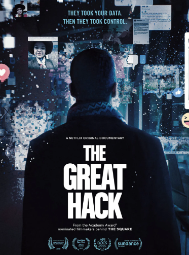

Potential risk: 
Similarly to how people were manipulated during the Facebook–Cambridge Analytica data scandal, we could employ a similar strategy by promoting specific movies as pivotal. For instance, if our goal is to sway people towards right-wing voting, we could choose a movie where the antagonists are foreigners and portrayed as terrorists, then market this film as pivotal. Subsequently, we could display advertisements advocating for right-wing voting, like voting UDC. Alternatively, we could produce a video featuring a preferred presidential candidate, emphasizing their intent to tighten border security.

To influence the public towards the left political side, we could focus on showcasing films that depict the harrowing conditions of civilians in war zones or the struggles of life in extreme poverty.

  
