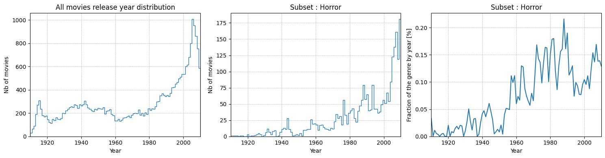
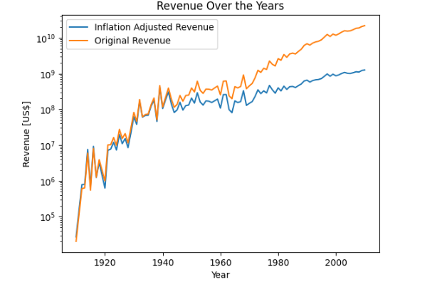
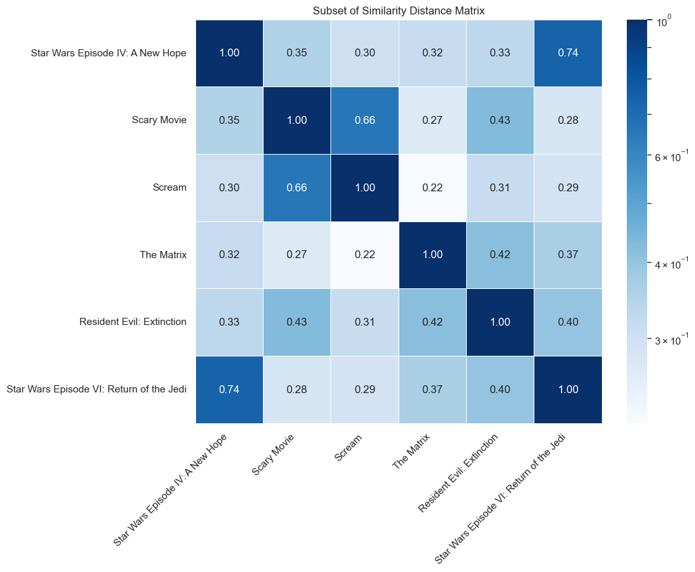

  

# Our Method

## Creating subsets

In the process of searching for Pivotal Movies, we need to extract smaller dataframes that can be handled more easily. As a first step, we limited our data to movies that are in English and have been produced in the USA between 1910 and 2010. In order to keep the probability of movies influencing one another high in a dataset (which is a required characteristic of a Pivotal Movie), we then decided to group the movies by genre. This way, we were able to identify 165 subsets, that contain at least 50 movies. Still the sets are not too big, so they can be handled easily and are suitable for the next steps. For subsets that contain too many movies (and don’t show sharp enough trends, see next paragraph), we divided the subsets further for movies that combine two genres. We were able to identify 424 additional subsets of double genres that contain at least 100 movies this way.

## Signal processing - Trend detection

To find a set of possible Pivotal Movies (called the candidate set), we need to detect the trends which they created. We define a trend as a significant positive variation in the number of movies released in a particular genre compared to the rest of the market. This trend is characterized by a notably high increase in the volume of movies of a specific genre, indicating a rising popularity or interest relative to others. Trends should be caracterize by a high bump, that represents a high popularity of the genre per year.  

We treat the function that describes the yearly percentual share of the subset (the genre) as a signal. Filtering this signal with a low-pass Butterworth filter (keeps the lower frequencies), returns a smoothed development of the fraction of the subset, minimizing the impact of short-term fluctuations. 

With this smoothed distribution, it is possible to detect the trends, that can be identified as local maxima (peaks). Peaks have to be higher than the average fraction over all time of the specific subset. We introduce an additional criteria to these peaks, which is that the point of inflexion before the peak (the point where the slope changes from getting steeper to getting less steep) has to yield a significantly lower fraction on the yearly market than the one at the peak. We call this metric the quality of a peak. It guarantees, that the peak is “high” enough to be showing a trend. While the peak identifies the trend, the inflexion point preceding a peak is a good indicator of where the Pivotal Movie might hide, that is responsible for the trend. 

<iframe src="plots/interactive_movie_data5.html" width="700" height="500" frameborder="0"></iframe>

## Extract the candidate sets

From the peaks that are judged of sufficient quality, we can extract the candidate set for Pivotal Movies. Since the inflexion point is an indicator of the pivotal location, we will search candidates for the trend around this point. It is important to choose a proper range of years around it, so we don’t miss the Pivotal Movie (too short range), and we don’t predict a movie without relation to the trend (too big range). We recognize that films that have been influenced by a trend wouldn’t be released immediately, as the time it takes to produce a movie from scratch is typically spanning two to three years ([1](https://nofilmschool.com/how-long-does-it-take-to-make-a-movie), [2](https://www.studiobinder.com/blog/how-long-does-it-take-to-make-a-movie/)). 

We define D as the difference in years between the inflexion point and the peak. This quantification allows us to identify the shape of the bump (steepness), which we utilize to search for Pivotal Movie candidates: We take the range of D years before the inflexion point (we limit the size of D to ten years) and two years after it, and select all movies that were released within that time as the candidate set. This way, the movies in the candidate sets have all been released during the time, when the hype has started, and could therefore be the Pivotal Movie of this trend. 

## Identify the Pivotal Movies

Having identified a set of possible Pivotal Movies in the candidate set, we use a machine learning algorithm to automatically determines the most Pivotal Movie out of each candidate set. For this purpose, a logistic regression model has been fed the following indicators, that represent a mix of industry experts, financial, and regular people metrics: 

### Rating & Number of votes

Critical reception is a key indicator of a movie’s impact and lasting influence. The Pivotal Movie should have received positive reviews from both critics and audiences, showcasing its quality and appeal. For this reason, the reviews are a metric of the model: supposedly, if a film is considered to be bad, there is a smaller chance that it influenced the movie industry and created a trend. The number of votes is included in the model too, since it accounts for the objectivity of the reviews. Having only a small number of reviews is making them less trustworthy, and also indicating that the movie is not that impactful. 

  

### Number of nominations & Number of won “Oscars”

Another metric that is to be included in the model is the recognition garnered through awards. Industry accolades serve as a validation of a movie’s cultural and artistic significance. The receipt of awards signifies not only the excellence of the film but also its potential to set a standard worth emulating. It provides more precise insights into why the film is esteemed. Noteworthy awards include prestigious honors like the Oscars. This is why we include the two metrics number of nominations and the number of “Oscars” that the movie finally won.

### Revenue

A Pivotal Movie supposedly often exhibits exceptional financial success, indicating a strong audience demand for the particular innovation. The box office revenue measures the financial success of movies, and is given in US$. Due to inflation, one dollar in 1910 compared to one dollar in 2010 is not worth the same. The purchasing power of the money has changed and this effect has to be accounted for, if two movies from different moments in time should be compared to each other. The [effect of inflation](https://www.officialdata.org/us/inflation/1800?amount=1#buying-power) has been accounted for, relating the worth of US dollar in each year to the worth of US dollar in 1800. 

  

### Plot similarity indices

The plot similarity serves as an assessment of the extent to which a film influences other movies within the same trend. The concept is as follows: If the plot of a potential Pivotal Movie closely resembles the plots of subsequent movies in the same trend, that indicates the movie’s influence on the plot development within the trend. This similarity suggests that other films intentionally emulated the storyline, signifying the impactful nature of the Pivotal Movie. The two metrics accounting for this effect are the plot similarity before (the plot of the movie compared to all plots of the movies that have been released earlier) and after (all movies that have been released later). 

  

### Distance to the peak

The model should include a parameter, that accounts for the moment, at which the movie was released. This metric measures how much time lies between the release of the movie with respect to the peak of the trend. It is a measure of how early in the creation of the trend the movie was released and could therefore have triggered the trend. 

## Training

The machine learning method (logistic regression) is in need of a training set, where we feed the algorithm labeled data (is a Pivotal Movie, is not a Pivotal Movie) so that it can learn to identify them. For this reason, a set of Pivotal Movies had to be identified. We based the content of this set on several resources ([1](https://www.imdb.com/list/ls000656362/) and [2](https://www.timeout.com/film/best-movies-of-all-time)), that describe what movies have been the most influential through time, to reduce bias of our own judgement. We tried to define the “most obvious” Pivotal Movies in this training set. 

Several different approaches on how to create the training set and what to include in it have been tested, before the best performing set could be identified. It contains the following movies: 

Pivotal Movies: 

- Star Wars IV: A New Hope (Science Fiction)
- The Karate Kid (Martial Arts Film)
- Toy Story (Computer Animation)
- The Searchers (Epic Western)
- Bonnie and Clyde (Gangster Film)
- Philadelphia (Gay)
- Pulp Fiction (Crime Comedy)
- The Lion King (Animation)
- The Exorcist (Horror)
- The Shining (Psychological Thriller)
- Titanic (Tragedy)
- Alien (Creature Film)

Non Pivotal Movies: 

- All other movies within the same genres (subsets) and trends as the above Pivotal Movies. 

### Now our model is ready, let’s see these [Pivotal Movies!](the_results.md)

