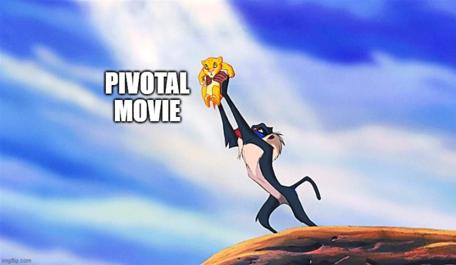
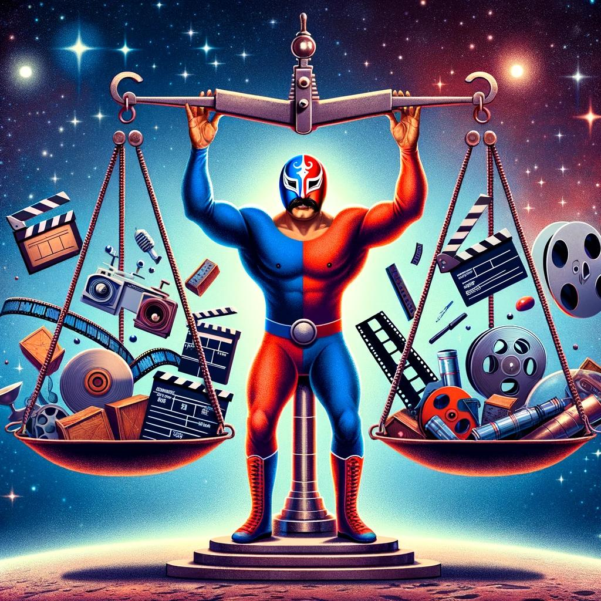
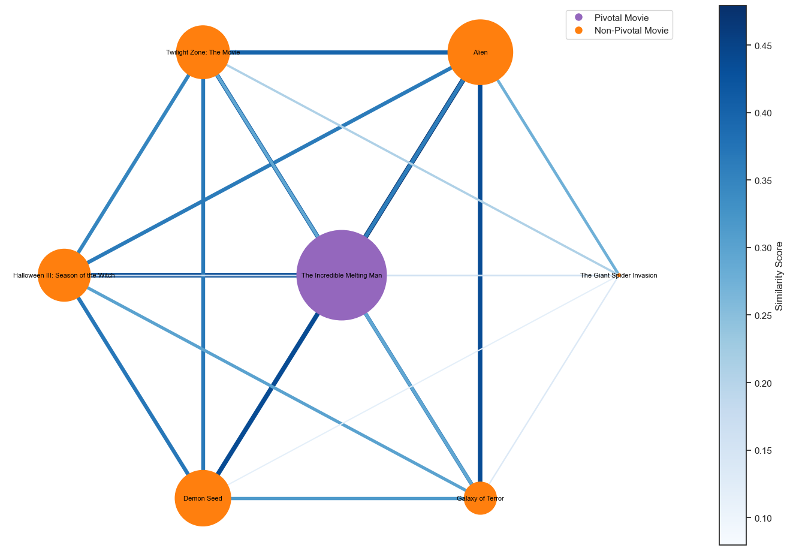

# The Results

Here are the 20 movies, that have been identified as being the "most pivotal" by our algorithm (they have achieved the highest scores (Probability) from the logistic regression model):

| Movie Title                           | Trend Tags                                    | Year | Probability |
|----------------------------------------|-----------------------------------------------|------|-------------|
| The Silence of the Lambs              | Crime Thriller                                | 1989 | 1.0000      |
| Forrest Gump                          | Coming of Age                                 | 1995 | 0.9999      |
| Lawrence of Arabia                    | Action/Adventure                              | 1966 | 0.9999      |
| Jurassic Park                         | Action, Horror                                | 2000 | 0.9999      |
| Doctor Zhivago                        | Drama, Romantic Drama                         | 1977 | 0.9999      |
| Platoon                                | Drama, Indie                                  | 1994 | 0.9999      |
| Jerry Maguire                         | Drama, Sports                                 | 1997 | 0.9999      |
| Gone with the Wind                    | Costume Drama                                | 1949 | 0.9999      |
| The Untouchables                      | Action, Crime Thriller                        | 1992 | 0.9998      |
| Fargo                                  | Comedy, Indie                                 | 1995 | 0.9997      |
| Back to the Future                    | Adventure, Family Film                        | 1991 | 0.9996      |
| Born on the Fourth of July            | Political Drama                               | 1994 | 0.9995      |
| Schindler's List                       | Biography                                    | 1996 | 0.9994      |
| Who Framed Roger Rabbit               | Crime Fiction                                | 1988 | 0.9987      |
| Dirty Dancing                          | Drama, Indie                                  | 1994 | 0.9985      |
| Butch Cassidy and the Sundance Kid    | Action/Adventure, Adventure                   | 1976 | 0.9984      |
| 2001 A Space Odyssey                  | Thriller                                     | 1968 | 0.9982      |
| Ghost                                  | Comedy, Drama                                 | 1989 | 0.9977      |
| Batman                                 | Crime Fiction, Thriller                       | 1987 | 0.9965      |
| Rain Man                               | Road Movie                                   | 1990 | 0.9961      |

It appears that some of these movies identified as pivotal in our analysis are present in the [IMDb Top 100 of Most Influential Movies](https://www.imdb.com/list/ls000656362/). The overlapping movies include (apart from those that we used in the training set):

- 2001 A Space Odyssey
- Lawrence of Arabia
- The Silence of the Lambs
- Forrest Gump
- Doctor Zhivago
- Butch Cassidy and the Sundance Kid
- Platoon
- Schindler's List
- Gone with the Wind

This alignment between our results and the IMDb list adds credibility to our findings and serves as a validation of the identified pivotal films. It seems that our algorithm is working!

Be careful though! Our results cannot just be taken for the truth, we have to critically assess them. We built a machine that returns something for whatever we feed it. Some results strike us as obvious: It makes sense that The Godfather of Francis Ford Coppola, released in 1972, is the Pivotal Movie of the Crime Fiction trend that peaked in 1977. It is often cited as a landmark of the genre.

On the other hand, some results need to be elaborated or questioned. The Silence of the Lambs by Jonathan Demme, released in 1991, and detected as the Pivotal Movie of the LGBT trend that peaked in 1993 for example. If you don’t know the movie, here is a quick synopsis: “A psychopath known as 'Buffalo Bill' wreaks havoc on the 'Middle West' by kidnapping and murdering young women. Clarice Starling, a young FBI agent, is assigned to interrogate ex-psychiatrist Hannibal Lecter. A fearsomely intelligent psychopath with a penchant for cannibalism, Lecter is able to provide her with information. A bond of fascination and repulsion develops between them.”

- First impression: it’s misclassified! this movie is not about LGBT thematic, actually some genres are too easily attributed, even if it isn’t the main topic of the movie, and if one main character got LGBT attributes, the whole movie will be labelled as LGBT. 
- After some reflection: actually not so many movies have been using LGBT main characters in their storylines in the past, so the fact that such a big success as Silence of the Lambs does might have put LGBT into the spotlight.
- More advanced thoughts: after some research, Silence of the Lambs has been criticised for repeating LGBT stereotypes, and [“impacted transgender people for the worse”](https://www.vox.com/culture/22281548/silence-of-the-lambs-cultural-impact-legacy-feminist-transphobia). However, LGBT is more than a simple “cinema genre”. Before that, it is a society phenomenon, so analysing it as a cinema genre is pretty difficult and might not give quality conclusions.
- Final point: even if Silence of the Lambs had a bad impact on the LGBT community, the result we have by finding it as a pivotal reflect that a society phenomenon started to rise around these years for the LGBT question. Which let’s us place the movie into a category of movies with at least a high tendency towards being a Pivotal Movie. 

Analyses like this are fascinating and make us realise that the movie industry and the real world are indeed intimately connected. 

## Pivotal Movie Influence: The Incredible Melting Man

In the analysis of Pivotal Movies, we can observe the inspirational impact that a pivotal movie can have on other successful films within a specific genre. Let's take a closer look at the example of "The Incredible Melting Man," identified as a Pivotal Movie for the Sci-Fi Horror trend of 1975.

### Network Graph Visualization

In the following network graph:

- Node Size: Represents the median of the similarity score.
- Edge Color: Indicates the plot similarity between two films (bluer edges represent higher similarity).
- Node Color: Purple node (center) represents the pivotal film for the Sci-Fi Horror trend of 1975.

### Observations:

- The central purple node has the largest size, signifying the highest median similarity score with other successful films in the same genre.
- The network structure demonstrates how this pivotal film has influenced and inspired other films within the Sci-Fi Horror trend of 1975.

This visualization provides insights into the significant role of "The Incredible Melting Man" in shaping the cinematic landscape within its genre during the specified trend.

## Find the Pivotal Movies of your favourite genre

In this graph you can choose the genre you're interested in, and our algorithm will present to you the Pivotal Movies within or correlated to this genre: 

<iframe src="plots/pivotals_movies_button2.html" width="700" height="500" frameborder="0"></iframe>
